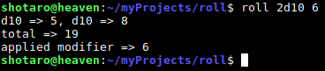

# roll 🎲
A dice roll javascript implementation.

## Instalation

```
git clone https://github.com/youngkaneda/roll
cd roll
npm install -g .
```

## How to use

```
$ roll 'dice' 'dice' ... 'modifier'
```

## Screenshots



## Features

1. you can roll any number of all the dice types, d4, d6, ..., d20.
2. you can add a modifier too. 

## Motivation

I saw the google version for dice roll and tried to implement it with node.js.

---

Feel free to fork and contribute.
